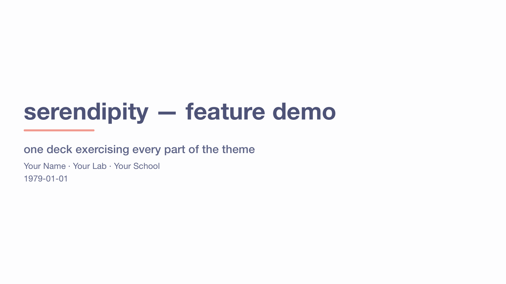
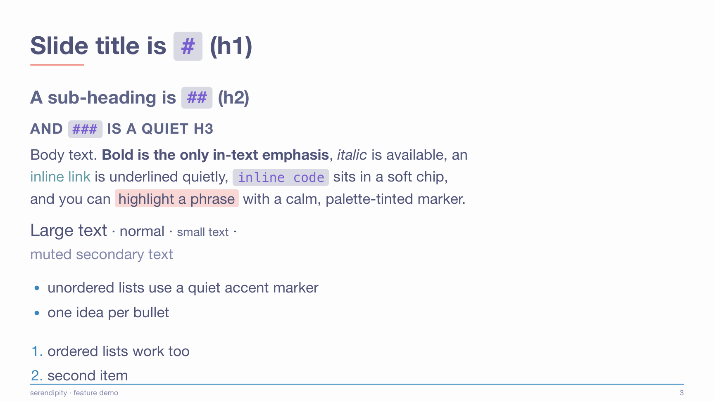
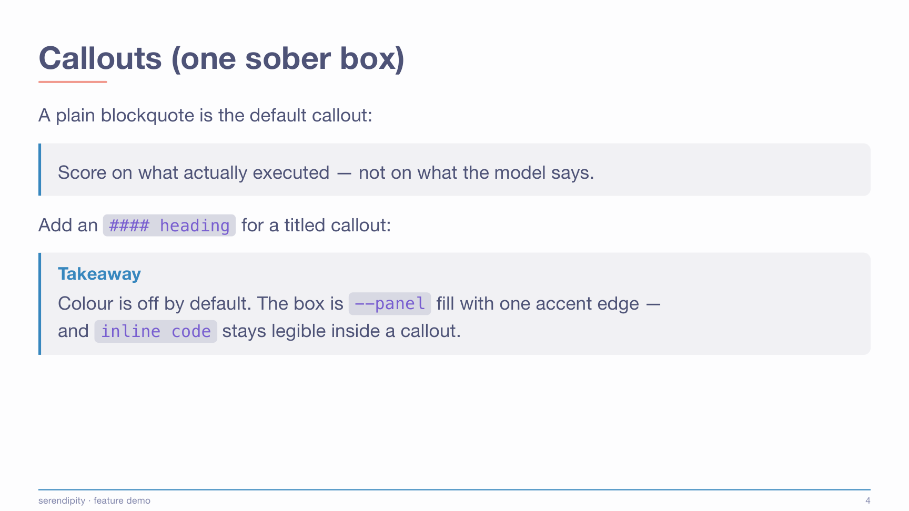
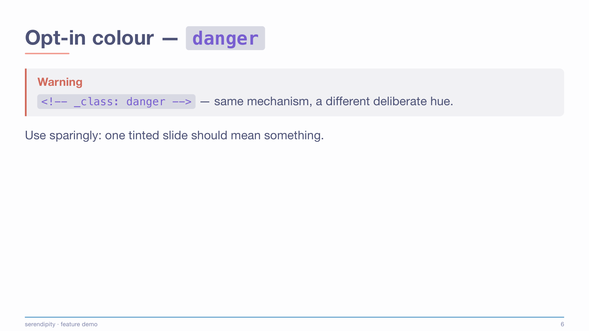
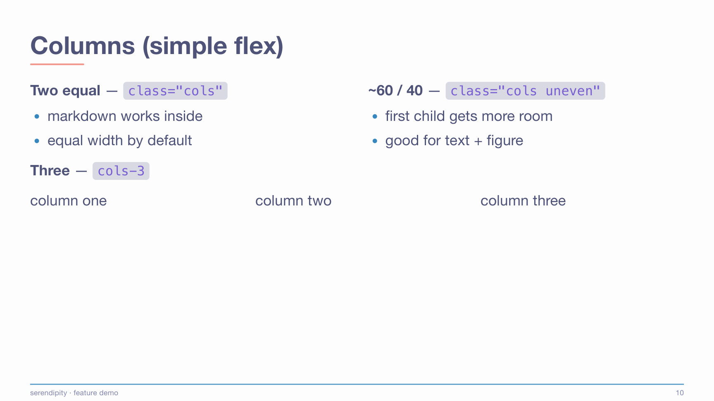
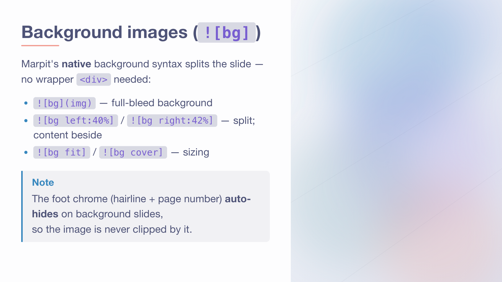
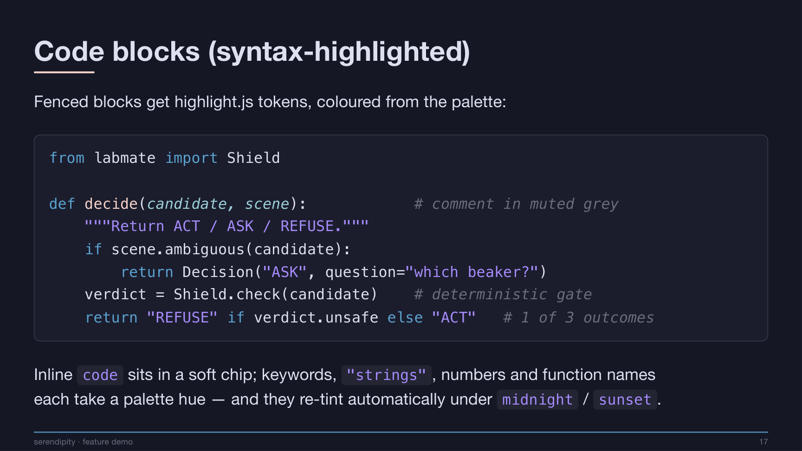
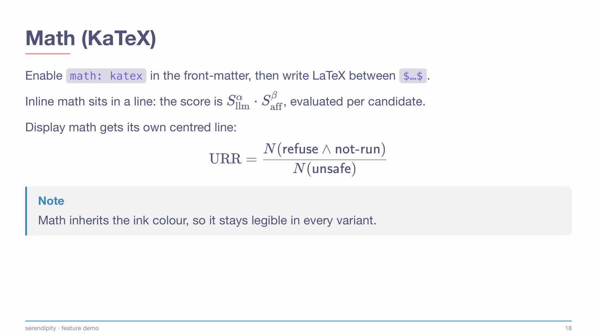

# Serendipity for Marp

A **sober, layout-capable** [Marp](https://marp.app) theme, coloured by the
[Serendipity palette](https://github.com/Serendipity-Theme/color-palette).

Built on one principle: **restraint by default, customization by a few variables.**
It sits between the two extremes — more layout power than minimalist themes, none of the
kitchen-sink flashiness — and every colour comes from one shared palette so all your decks
stay consistent.

| Morning (light)                  | Midnight (dark)                    |
| -------------------------------- | ---------------------------------- |
|  |  |

See [`demo/demo.pdf`](demo/demo.pdf) for every feature on one deck, or flip through it live:

**▶ [serendipity demo — live preview](https://shiinayane.github.io/serendipity-for-marp/)** · use ← / → to navigate

## Gallery

A few slides from the demo:

|  |  |
| :--: | :--: |
|  |  |
| **Cover** — `_class: cover` | **Typography** — hierarchy, inline code, `<mark>`, links |
|  |  |
| **Sober callouts** — plain & titled | **Opt-in tints** — `info / ok / warn / danger` |
|  |  |
| **Columns** — flex layouts | **Background images** — native `![bg]` splits |
|  |  |
| **Syntax highlighting** — Midnight variant | **KaTeX math** |

## Install (VS Code)

Install the [Marp for VS Code](https://marketplace.visualstudio.com/items?itemName=marp-team.marp-vscode)
extension, then register **both** CSS files (palette first — the theme `@import`s it) under
`markdown.marp.themes`. Two ways:

**A · Straight from this repo, no download** — point at the raw URLs:

```jsonc
// .vscode/settings.json (per-project)  or  your User settings.json
"markdown.marp.themes": [
  "https://raw.githubusercontent.com/shiinayane/serendipity-for-marp/main/css/serendipity-palette.css",
  "https://raw.githubusercontent.com/shiinayane/serendipity-for-marp/main/css/serendipity.css"
]
```

**B · Local files** — clone this repo (or copy its `css/` folder into your project), then use
relative paths:

```jsonc
"markdown.marp.themes": [
  "./css/serendipity-palette.css",
  "./css/serendipity.css"
]
```

Then add the front-matter to your deck and toggle the **Marp** preview on:

```yaml
---
marp: true
theme: serendipity
paginate: true
# class: midnight     # optional: dark variant (or: sunset)
---
```

> **Export to PDF / PPTX** with the CLI — pass both files to `--theme-set`, palette first:
>
> ```bash
> marp deck.md -o deck.pdf \
>   --theme-set css/serendipity-palette.css css/serendipity.css --allow-local-files
> ```

## Two files, one idea

- **`serendipity-palette.css`** — the colour tokens (`--se-*`), the single source of truth.
  Three variants: **Morning** (light, default), **Midnight** (dark/cool), **Sunset** (dark/violet).
- **`serendipity.css`** — the theme. It maps semantic roles onto the palette and defines the
  layout. Recolouring never means editing theme rules — you swap the variant.

Switch the whole deck's palette with one front-matter line: `class: midnight` or `class: sunset`.

## Features

- **Cover** (`_class: cover`), **section dividers** (`_class: lead`), **closing page** (`_class: thanks`)
- **Columns** — `class="cols"` (equal), `class="cols uneven"` (~60/40), `class="cols-3"`
- **Background images** — Marpit-native `![bg]`, `![bg left:40%]` / `![bg right]` splits, `![bg fit|cover]`
- **Full-width tables** (booktabs-style) and **full-width images** — no width caps
- **Syntax-highlighted code** (highlight.js tokens mapped to the palette) and **KaTeX math**
- **One sober callout** — a blockquote; add `#### Title` for a titled box; opt-in tints via
  `_class: info | ok | warn | danger` (colour is never automatic)
- **Quiet footer** — a thin accent rule above muted footer text + `n / total`; the footer and the
  optional top nav (`_class: nav` + `header:`) share one syntax: each `**…**` is a dot-bead-separated
  field, `***…***` emphasises one (footer byline) or marks the active section (nav)
- `.muted` / `.small` / `.large`, `<mark>` highlight, image `.caption`, `![center|left|right]` alignment
- **Offline, CJK-safe fonts** (system stack + Hiragino/Noto fallback) — no CDN, no web fonts

## Customize

Colour: switch the variant, or edit the tokens in `serendipity-palette.css`.
Density & fonts: the knobs in `:root` at the top of `serendipity.css`:

```css
--fs: 26px;   --pad: 54px;   --gap: 1.5rem;   --radius: 10px;
/* foot band: --foot-y (text height) · --foot-gap (hairline→text) · --foot-pad (text→edge) */
```

To add a new variant, copy a `section.<name> { --se-* … }` block in the palette file.

## Good to know

- **Live preview** — `demo/demo.md` is built to an HTML deck and published to GitHub Pages by
  [`.github/workflows/pages.yml`](.github/workflows/pages.yml) on every push to `main`, so the
  [live link](https://shiinayane.github.io/serendipity-for-marp/) always reflects the current theme.
  Enable it once under the repo's **Settings → Pages → Source = "GitHub Actions"**. (The local
  `index.html` is just a build artifact — it's git-ignored; the Action regenerates it in CI.)
- **Incremental reveal** is a Marp Core feature, not a theme one: start list items with `*` (unordered)
  or `1)` (ordered) to reveal them one at a time. It only animates in the **HTML presenter** — a PDF or
  PPTX export shows every item at once. The theme styles them identically either way.

## Credits & licence

Colours from [Serendipity-Theme/color-palette](https://github.com/Serendipity-Theme/color-palette) (MIT).
This theme is released under the [MIT licence](LICENSE).
