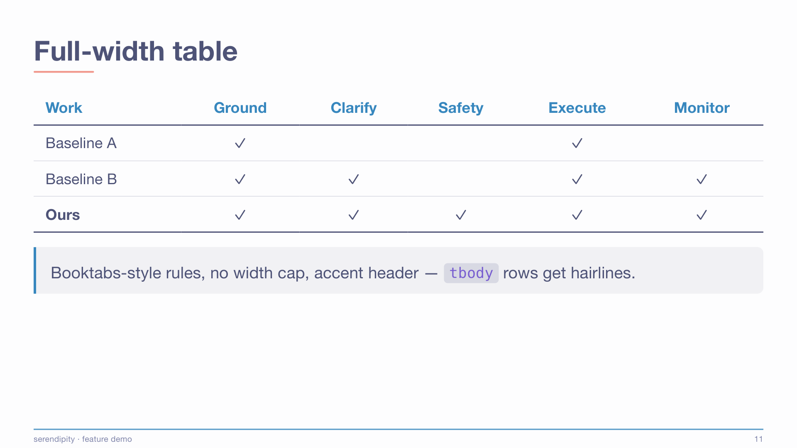
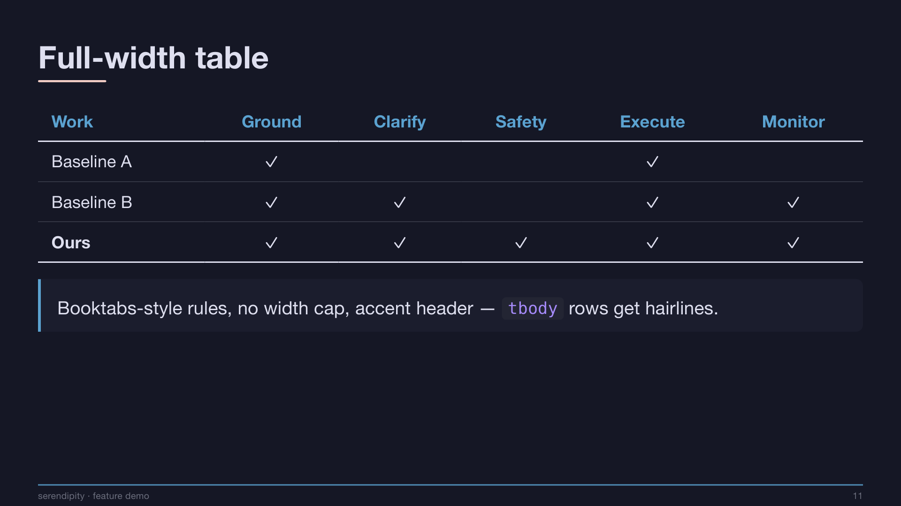

# Serendipity for Marp

A **sober, layout-capable** [Marp](https://marp.app) theme, coloured by the
[Serendipity palette](https://github.com/Serendipity-Theme/color-palette).

Built on one principle: **restraint by default, customization by a few variables.**
It sits between the two extremes — more layout power than minimalist themes, none of the
kitchen-sink flashiness — and every colour comes from one shared palette so all your decks
stay consistent.

| Morning (light)                  | Midnight (dark)                    |
| -------------------------------- | ---------------------------------- |
|  |  |

See [`demo/demo.pdf`](demo/demo.pdf) for every feature on one deck.

## Install

Copy the two CSS files into your project (or add this repo as a submodule). The theme
`@import`s the palette, so **pass both to `--theme-set`, palette first**:

```bash
marp deck.md -o deck.pdf \
  --theme-set css/serendipity-palette.css css/serendipity.css --allow-local-files
```

On **Overleaf/VS Code (Marp extension)**: register both CSS paths in the Marp themes setting.

In your deck's front-matter:

```yaml
---
marp: true
theme: serendipity
paginate: true
# class: midnight     # optional: dark variant (or: sunset)
---
```

## Two files, one idea

- **`serendipity-palette.css`** — the colour tokens (`--se-*`), the single source of truth.
  Three variants: **Morning** (light, default), **Midnight** (dark/cool), **Sunset** (dark/violet).
- **`serendipity.css`** — the theme. It maps semantic roles onto the palette and defines the
  layout. Recolouring never means editing theme rules — you swap the variant.

Switch the whole deck's palette with one front-matter line: `class: midnight` or `class: sunset`.

## Features

- **Cover** (`_class: cover`), **section dividers** (`_class: lead`), **closing page** (`_class: thanks`)
- **Columns** — `class="cols"` (equal), `class="cols uneven"` (~60/40), `class="cols-3"`
- **Background images** — Marpit-native `![bg]`, `![bg left:40%]` / `![bg right]` splits, `![bg fit|cover]`
- **Full-width tables** (booktabs-style) and **full-width images** — no width caps
- **Syntax-highlighted code** (highlight.js tokens mapped to the palette) and **KaTeX math**
- **One sober callout** — a blockquote; add `#### Title` for a titled box; opt-in tints via
  `_class: info | ok | warn | danger` (colour is never automatic)
- **Quiet footer** — a thin accent rule above muted footer text + page number; multi-field footers
  (`footer:` with several `<span>`s); optional top nav (`_class: nav` + `header:`)
- `.muted` / `.small` / `.large`, `<mark>` highlight, image `.caption`, `![center|left|right]` alignment
- **Offline, CJK-safe fonts** (system stack + Hiragino/Noto fallback) — no CDN, no web fonts

## Customize

Colour: switch the variant, or edit the tokens in `serendipity-palette.css`.
Density & fonts: the knobs in `:root` at the top of `serendipity.css`:

```css
--fs: 26px;   --pad: 54px;   --gap: 1.5rem;   --radius: 10px;
/* foot band: --foot-y (text height) · --foot-gap (hairline→text) · --foot-pad (text→edge) */
```

To add a new variant, copy a `section.<name> { --se-* … }` block in the palette file.

## Good to know

- **Incremental reveal** is a Marp Core feature, not a theme one: start list items with `*` (unordered)
  or `1)` (ordered) to reveal them one at a time. It only animates in the **HTML presenter** — a PDF or
  PPTX export shows every item at once. The theme styles them identically either way.

## Credits & licence

Colours from [Serendipity-Theme/color-palette](https://github.com/Serendipity-Theme/color-palette) (MIT).
This theme is released under the [MIT licence](LICENSE).
