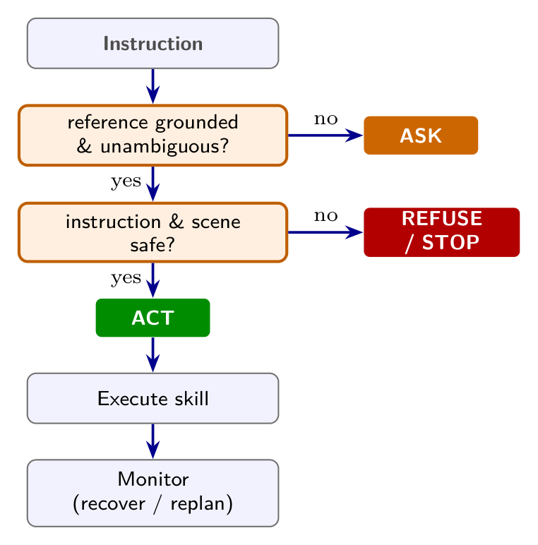
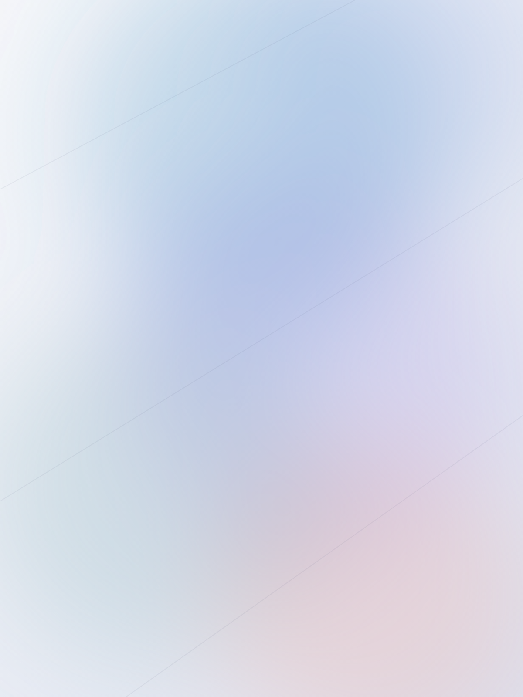

<!-- _class: cover -->
<!-- _paginate: false -->
<!-- _footer: '' -->

# serendipity — feature demo

## one deck exercising every part of the theme

Your Name · Your Lab · Your School
1979-01-01

---

<!-- _class: lead -->

# 1 · Text & typography

---

# Slide title is `#` (h1)

## A sub-heading is `##` (h2)

### And `###` is a quiet h3

Body text. **Bold is the only in-text emphasis**, *italic* is available, an
[inline link](https://marp.app) is underlined quietly, `inline code` sits in a soft chip,
and you can <mark>highlight a phrase</mark> with a calm, palette-tinted marker.

<span class="large">Large text</span> · normal · <span class="small">small text</span> ·
<span class="muted">muted secondary text</span>

- unordered lists use a quiet accent marker
- one idea per bullet

1. ordered lists work too
2. second item

---

# Callouts (one sober box)

A plain blockquote is the default callout:

> Score on what actually executed — not on what the model says.

Add an `#### heading` for a titled callout:

> #### Takeaway
>
> Colour is off by default. The box is `--panel` fill with one accent edge —
> and `inline code` stays legible inside a callout.

---

<!-- _class: info -->

# Opt-in colour — `info`

Colour is **never automatic**. Put a class on the slide only when you mean it.

> #### Note
>
> `<!-- _class: info -->` tints every callout on this slide.

The full set: `info` · `ok` · `warn` · `danger` — all low-saturation.

---

<!-- _class: danger -->

# Opt-in colour — `danger`

> #### Warning
>
> `<!-- _class: danger -->` — same mechanism, a different deliberate hue.

Use sparingly: one tinted slide should mean something.

---

<!-- _class: ok -->

# Opt-in colour — `ok`

> #### Done
>
> `<!-- _class: ok -->` for a calm positive note (cadet-blue).

The full family — `info` · `ok` · `warn` · `danger` — is low-saturation by design.

---

<!-- _class: warn -->

# Opt-in colour — `warn`

> #### Heads-up
>
> `<!-- _class: warn -->` for a soft caution (vivid-tangerine).

Same mechanism every time: the class tints the callout edge and its `####` title.

---

<!-- _class: lead -->

# 2 · Layout

---

# Columns (simple flex)

<div class="cols">
<div>

**Two equal** — `class="cols"`

- markdown works inside
- equal width by default

</div>
<div>

**~60 / 40** — `class="cols uneven"`

- first child gets more room
- good for text + figure

</div>
</div>

**Three** — `cols-3`

<div class="cols-3">
<div>

column one

</div>
<div>

column two

</div>
<div>

column three

</div>
</div>

---

# Full-width table

| Work       | Ground | Clarify | Safety | Execute | Monitor |
| ---------- | :----: | :-----: | :----: | :-----: | :-----: |
| Baseline A |   ✓    |         |        |    ✓    |         |
| Baseline B |   ✓    |    ✓    |        |    ✓    |    ✓    |
| **Ours**   |   ✓    |    ✓    |   ✓    |    ✓    |    ✓    |

> Booktabs-style rules, no width cap, accent header — `tbody` rows get hairlines.

---

# Image & caption

<div class="cols uneven">
<div>



<div class="caption">Figure 1. A centered image with a <code>.caption</code>.</div>

</div>
<div>

- `![w:380 center]` centers and sizes
- `![left]` / `![right]` float text around it
- no 50% width cap — images go full size

</div>
</div>

---

# Image float & text wrap

<div>


Use `![left]` (or `![right]`) to float a figure and let the prose wrap around it —
handy when an image supports a paragraph rather than standing on its own.
**Wrap the image + text in a `<div>`** so it flows as a block (the slide itself is a
flex column, where floats wouldn't wrap).

The decision diagram on the left flows *instruction → ground → decide → execute*, while
this text wraps naturally beside it. Size it with `w:`; there is no width cap, so the same
syntax scales from a thumbnail to a full-bleed figure.

</div>

---



# Background images (`![bg]`)

Marpit's **native** background syntax splits the slide — no wrapper `<div>` needed:

- `` — full-bleed background
- `![bg left:40%]` / `![bg right:42%]` — split; content beside
- `![bg fit]` / `![bg cover]` — sizing

> #### Note
>
> The foot chrome (hairline + page number) **auto-hides** on background slides,
> so the image is never clipped by it.

---

<!-- _class: nav -->
<!-- header: 'Motivation · **Method** · Results · Conclusion' -->
<!-- _footer: '<span>Your Name</span><span>Method · Results</span><span>2026</span>' -->

# Optional top nav

Add `<!-- _class: nav -->` plus a `header:` to get a quiet section nav
(bold the current one). Useful for longer talks.

> A tracked eyebrow up top with the current section in bold — and the **footer** here is three
> `<span>` fields (`Name · Topic · Year`) that space out automatically.

---

<!-- _class: lead -->
<!-- header: '' -->

# 3 · Code & math

---

# Code blocks (syntax-highlighted)

Fenced blocks get highlight.js tokens, coloured from the palette:

```python
from labmate import Shield

def decide(candidate, scene):            # comment in muted grey
    """Return ACT / ASK / REFUSE."""
    if scene.ambiguous(candidate):
        return Decision("ASK", question="which beaker?")
    verdict = Shield.check(candidate)    # deterministic gate
    return "REFUSE" if verdict.unsafe else "ACT"   # 1 of 3 outcomes
```

Inline `code` sits in a soft chip; keywords, `"strings"`, numbers and function names
each take a palette hue — and they re-tint automatically under `midnight` / `sunset`.

---

# Math (KaTeX)

Enable `math: katex` in the front-matter, then write LaTeX between `$…$`.

Inline math sits in a line: the score is $S_{\mathrm{llm}}^{\alpha}\cdot S_{\mathrm{aff}}^{\beta}$, evaluated per candidate.

Display math gets its own centred line:

$$ \mathrm{URR}=\frac{N(\textsf{refuse}\wedge\textsf{not\text{-}run})}{N(\textsf{unsafe})} $$

> #### Note
>
> Math inherits the ink colour, so it stays legible in every variant.

---

<!-- _class: lead -->
<!-- header: '' -->

# 4 · Customize

---

# Recolour with one line; tune with a few

Colour is the shared **Serendipity** palette. Switch the whole deck in front-matter:

```yaml
class: midnight    # dark · cool      (or  sunset  — dark · violet)
```

Density & fonts are the only knobs (`:root` in `serendipity.css`):

```css
--fs: 26px;   --pad: 54px;   --gap: 1.5rem;
```

> #### The point
>
> The palette is the single source of truth — every theme maps onto it. Restraint by default, power on demand.

---

<!-- _class: thanks -->

# serendipity

restraint by default · power on demand

[github.com/Serendipity-Theme](https://github.com/Serendipity-Theme) · your@email
